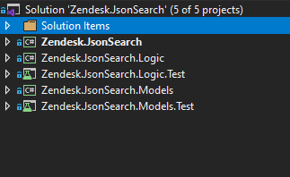
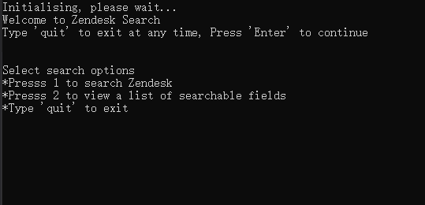
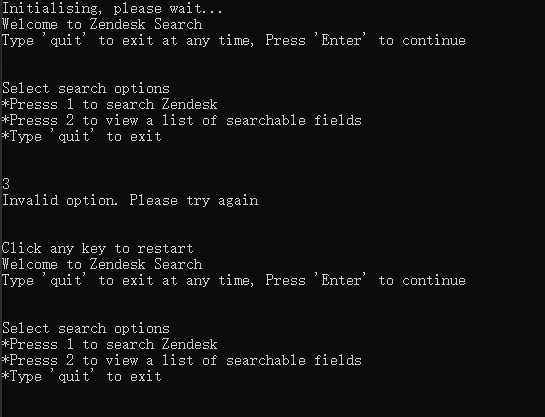
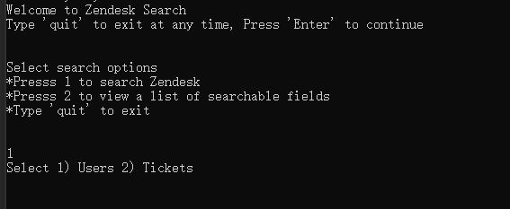
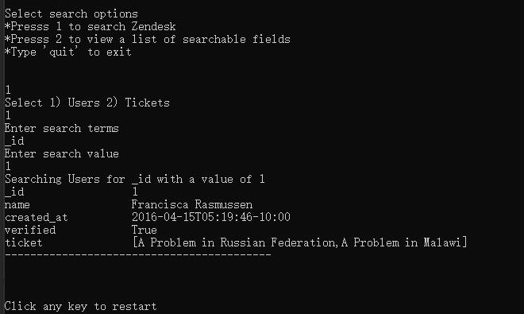
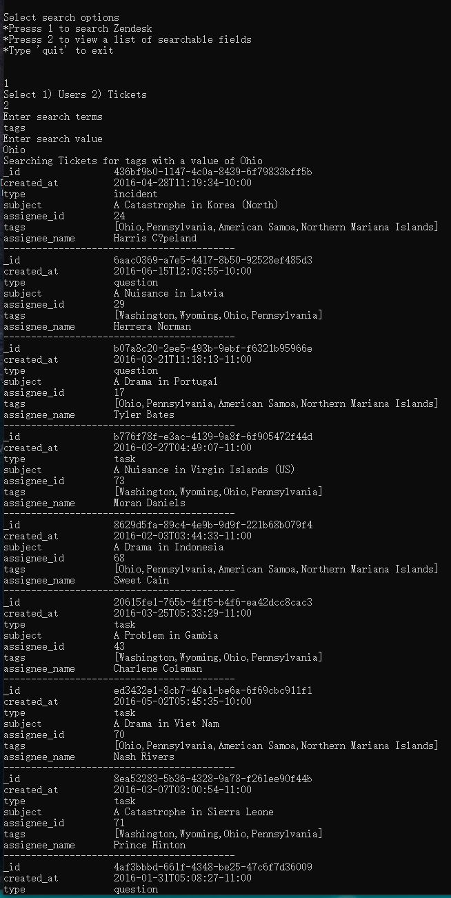
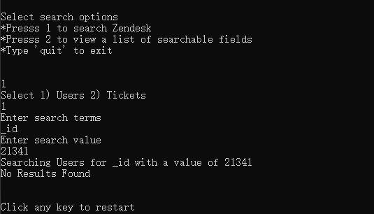
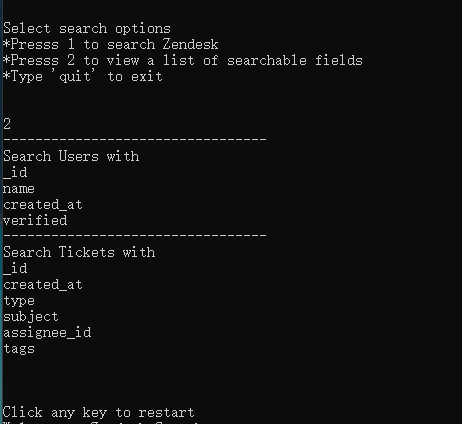

# Zendesk Json Search Project

This project is to search a mocked database using json files by available property name and value. it is written in .net core.

## System Design 

Extensibility is always essential for platform app. <br>
In this code test, there are only two json files (user and ticket) provided, an ideal solution needs to be able to handle any json files with same format. So instead of creating specific class for user and ticket, a generic entity is defined to
handle any entity json files (user, ticket, or any other entity json files)<br>
Metadata is introduced to define the properties and relationship for entities to handle different data.<br>


Here is defination of metadata.json:
```json
{
  "entities": [
    {
      "filename": "This is physical file name",
      "displayname": "This is the display name of the entity",
      "entityname": "This is the real entity name. It must be unique",
      "entitycode": "This is the entity uniqe code. This is used to mapping entity metdata when structure gets more complicated. (e.x. we introduce enumerations and save as different table)",
      "nameproperty": "This is the property name which will be saved in name field. Name field is used to be displayed when it is used as lookup.",
      "properties": [
        "This include all avaialble properties that entity contains. Available search terms are reading from here"        
      ],
      "indexingproperties": [
        "This include all properties that requires indexing to be created" 
      ]
    }
  ],
  "relationships": [
    {
      "fromentity": "This is the related from entity name (in provided case it is user entity)",
      "fromproperty": "This is always the id (primary key) column (in provided case it is user entity _id column)",
      "toentity": "This is the related to entity name (in provided case it is ticket entity)",
      "toproperty": "This is the foreign key property name (in provided case it is ticket entity assignee_id column)"
    }
  ]
}
```
In real production environment the metadata should be saved in database as well.<br>
The app is designed to handle any valid json, not limited to ticket and user provided.

one of the challenge for this code test is to maintain performance with large amount of data, to achieve this, indexes are introduced using dictionary data structure. The indexes are also configurable in the metadata.json. 

## Extension Option

This app allows user to do redevelopment. User is able to create new entities and relationships.<br>
In Zendesk.JsonSearch.Models project, there is a EarlyBound folder including User and Ticket classes. These classes should be generated by an automation tool provided to user, so user can generate specific classes which can help them make redevelopment process easier.

## Assumption
1. The RAM is big enought to hold all data (entities, metadata and indexing dictionaries) in memory.
2. The search is always exact match. So it will not have blur search (e.x. *) and range query (e.x. > 1) Currently the indexing is built with dictionaries (similar to hash in .net). If range query needs to be supported, b+ tree indexing needs to be created.

## Project structure


<b>Zendesk.JsonSearch</b> - The console app entry point. Including all console app related components such as printing.<br>
<b>Zendesk.JsonSearch.Logic</b> - This is the main logic library holding all key logic. This is separated as a differnt library because it can be reused if the project is extended, for example, having a UI project for search, or having a website.<br>
<b>Zendesk.JsonSearch.Logic.Test</b> - Unit test project for Zendesk.JsonSearch.Logic<br>
<b>Zendesk.JsonSearch.Models</b> - This includes all shared models. This is seperated as a differnet library because this can be used when doing redevelopment. For example, we can supply this library to client and client can use this library to access new entities created by them and develop their own logic. <br>
<b>zendesk.JsonSearch.Models.Test</b> - Unit test project for Zendesk.JsonSearch.Models<br>

## Installation

### Running using Docker


DOCKER: Install docker from https://docs.docker.com/get-docker/
 
Build Image
Navigate to the root project folder in command line window (bash, cmd, etc)

```
git clone https://github.com/sy8718/Zendesk.JsonSearch.App.git
cd ./Zendesk.JsonSearch.App
```

```
Docker build -t kevin.zendesk.jsonsearch . 
```
Run app

```
Docker run -ti kevin.zendesk.jsonsearch
```
Build test image

```
Docker build --target testrunner -t kevin.zendesk.jsonsearch.test .
```
Run test 
```
Docker run -ti kevin.zendesk.jsonsearch.test
```

### Run app locally

prefered code editor: VS code https://code.visualstudio.com/download

preferred IDE:Visual Studio 

For VS code, follow the steps below to set up

2. Download and install .Net Core 3.1.22 SDK from https://dotnet.microsoft.com/en-us/download/dotnet/3.1

4. Add C# Extensions to VS code or install from here https://marketplace.visualstudio.com/items?itemName=ms-dotnettools.csharp 
```
git clone https://github.com/sy8718/Zendesk.JsonSearch.App.git
cd ./Zendesk.JsonSearch.App
```
Build solutions
```
dotnet build
```

Run app

```
cd ./Zendesk.JsonSearch
dotnet run
```
Run test at the root folder of the app

```
dotnet test
```


## Using the app

1. Start the App

	
2. User can type "quit" anytime to quit the app
3. Type any invalid option will get "Invalid option. Please try again. " message.
	
    
4. If select 1, user has multiple entities to search. It depends on how many json files under Files/Entities folder
	
    
5. If type in any invalid option, same error message as step 3 will printed.
6. When all input are valid, result will be printed. Please press "enter" directly when entering search value to search missing value records.
   
    
7. If there are multiple records, all records will be printed.
    
    
8. If no result found, "No Result Found" will be printed.
    
    
9. User can get all available search terms by using option 2 in initial selection. Available search terms can be modified in metadata.json
    
    


## Notes

1.In the two given jsons for ticket and user, the data type for id is not consistent, so a type conversion is needed for the app. 
Ideally guid or uuid is suggested for id as they are unique when generation and can hold huge amount of volume.

2.If fields like "type" in ticket can be saved as integar (Enumeration) in db, searching performance can be improved.

## Further improvements

1. If range query needs to be supported, indexing needs to be b+ tree.
2. More metadata needs to be created to define field settings, such as field display name, field name, field type, field limitation, etc. This can standardise the data model and help redevelopemnt. For example, created_at should be Date type, field name should be created_at (unique) and display name can be configured by client.


